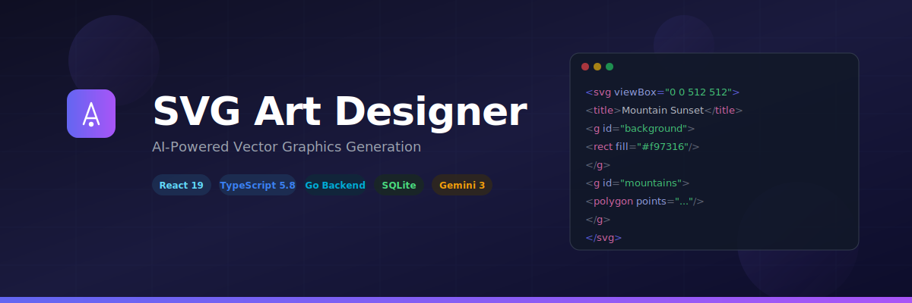

<div align="center">



# SVG Art Designer

**Full-stack AI-powered SVG vector graphics generator — describe what you want, get production-ready SVG.**

[](https://react.dev)
[](https://www.typescriptlang.org)
[](https://go.dev)
[](https://pkg.go.dev/modernc.org/sqlite)
[](https://ai.google.dev)
[](https://vite.dev)

</div>

## Overview

SVG Art Designer turns natural language prompts into high-quality, scalable vector graphics using Google's Gemini 3 AI. A Go backend proxies all AI calls, encrypts API keys at rest, and persists design history in SQLite — so secrets never touch the browser and your work is always saved.

Generate icons, logos, abstract art, and more — then refine them through multi-turn conversation, manage individual layers, add animations, and export as SVG or PNG.

## Features

- **AI SVG Generation** — Describe any graphic in plain text and receive complete, self-contained SVG code
- **9 Art Styles** — None, Icon, Flat Design, Cartoon, Line Art, Logo, Abstract, Gradient, Pixel Art
- **Multi-Turn Refinement** — Iteratively refine designs through follow-up prompts in the same session
- **Prompt Enhancement** — AI-powered prompt rewriter to improve vague descriptions before generation
- **Layer Management** — Toggle visibility, reorder, group/ungroup, multi-select, and delete individual SVG elements
- **Animation Support** — Generate SVGs with SMIL or CSS keyframe animations
- **Dual View Mode** — Switch between live preview (with zoom controls) and raw SVG code editing
- **Export Options** — Copy SVG code, download as `.svg`, or render and download as `.png`
- **Design History** — All generations persist to SQLite with timestamps, settings, and full SVG content
- **Encrypted Key Storage** — API keys encrypted with AES-256-GCM and stored server-side
- **Settings Dialog** — Configure your Gemini API key from the UI — no env files needed
- **Model Selection** — Toggle between Gemini 3 Flash (fast) and Gemini 3.1 Pro (advanced)
- **Rate Limiting** — Per-IP token bucket protects AI generation endpoints
- **Responsive UI** — Full desktop layout with collapsible mobile drawer

## Architecture

```
┌─────────────────────────────────────────────────────────────┐
│  Frontend (React 19 + TypeScript + Vite)                    │
│                                                             │
│  App.tsx ─── components/                                    │
│    │         ├── Header.tsx          (nav + settings btn)   │
│    │         ├── InputSection.tsx    (prompt + send)         │
│    │         ├── StyleSelector.tsx   (art style grid)        │
│    │         ├── PreviewArea.tsx     (preview/code/export)   │
│    │         ├── LayerPanel.tsx      (layer controls)        │
│    │         └── SettingsDialog.tsx  (API key management)    │
│    │                                                        │
│    ├── services/                                            │
│    │   ├── geminiService.ts   (proxy calls to /api/*)       │
│    │   └── apiService.ts      (designs + keys CRUD)         │
│    │                                                        │
│    ├── utils/svgLayerUtils.ts (pure SVG DOM helpers)        │
│    └── types.ts                                             │
└──────────────────────┬──────────────────────────────────────┘
                       │  /api/*  (Vite proxy in dev)
┌──────────────────────▼──────────────────────────────────────┐
│  Backend (Go 1.22+ · Pure Go · No CGO)                     │
│                                                             │
│  cmd/server/main.go ─── Routes + middleware + shutdown      │
│    │                                                        │
│    ├── internal/handler/                                    │
│    │   ├── designs.go      (GET/POST/DELETE /api/designs)   │
│    │   ├── apikeys.go      (GET/POST/PUT/DELETE /api/keys)  │
│    │   ├── gemini.go       (POST /api/generate, /enhance)   │
│    │   ├── middleware.go   (CORS, logging, JSON helpers)     │
│    │   └── ratelimit.go   (per-IP token bucket)             │
│    │                                                        │
│    ├── internal/gemini/client.go  (Gemini SDK wrapper)      │
│    ├── internal/model/                                      │
│    │   ├── design.go       (design CRUD + pagination)       │
│    │   └── apikey.go       (encrypted key store)            │
│    ├── internal/database/  (SQLite + migrations)            │
│    ├── internal/crypto/    (AES-256-GCM encryption)         │
│    └── internal/config/    (env var loading)                │
└─────────────────────────────────────────────────────────────┘
```

**Key design decisions:**

- **Server-side API proxy** — The frontend never touches the Gemini API directly; all AI calls go through the Go backend
- **Encrypted secrets** — API keys are encrypted with AES-256-GCM using a master key before storage in SQLite
- **Session-based chat** — A persistent Gemini chat session enables multi-turn refinements without losing context
- **Pure Go SQLite** — `modernc.org/sqlite` provides full SQLite with zero CGO, building on any OS with `go build`
- **Pure layer utilities** — SVG manipulation uses browser DOMParser/XMLSerializer with no external dependencies
- **Single binary production build** — Go embeds the Vite dist/ output for single-artifact deployment

## Getting Started

### Prerequisites

- [Go](https://go.dev) 1.22+
- [Node.js](https://nodejs.org) v18+
- A [Gemini API key](https://aistudio.google.com/apikey)

### Installation

```bash
git clone https://github.com/ajbergh/SVG-Art-Designer.git
cd SVG-Art-Designer
npm install
cd backend && go mod tidy && cd ..
```

### Run (Development)

**Option 1 — Windows script:**

```bash
scripts\start-dev.bat
```

**Option 2 — Manual (two terminals):**

```bash
# Terminal 1: Backend
cd backend
go run ./cmd/server

# Terminal 2: Frontend
npm run dev
```

The app opens at [http://localhost:5173](http://localhost:5173). The Vite dev server proxies `/api/*` to the Go backend on port 8080.

### Configure API Key

1. Click the **Settings** gear icon in the header
2. Paste your Gemini API key and click **Save**
3. The key is encrypted and stored in the local SQLite database

Or set it via environment variable before starting the backend:

```bash
set GEMINI_API_KEY=your_key_here   # Windows
export GEMINI_API_KEY=your_key     # macOS/Linux
```

### Build for Production

```bash
# Build frontend
npm run build

# Build Go binary with embedded frontend
cd backend
go build -tags production -o ../bin/svg-art-designer ./cmd/server
```

The resulting binary serves both the API and the frontend — no separate web server needed.

## Usage

1. **Configure** — Open Settings and enter your Gemini API key (one-time setup)
2. **Enter a prompt** — Describe the SVG you want (e.g. "a sunset over mountains with birds")
3. **Pick a style** — Select from 9 art styles or leave as None for freeform
4. **Generate** — Hit Send or press Enter
5. **Refine** — Send follow-up prompts to iterate on the current design
6. **Edit layers** — Open the layer panel to toggle, reorder, group, or delete elements
7. **Export** — Copy the SVG code, download as `.svg`, or export as `.png`

## API Endpoints

| Method | Endpoint | Description |
|--------|----------|-------------|
| `POST` | `/api/generate` | Generate SVG via Gemini (rate limited) |
| `POST` | `/api/enhance` | Enhance a prompt via Gemini (rate limited) |
| `POST` | `/api/session/reset` | Reset the Gemini chat session |
| `GET` | `/api/designs` | List designs (paginated, filterable) |
| `GET` | `/api/designs/{id}` | Get a single design |
| `POST` | `/api/designs` | Create a design |
| `DELETE` | `/api/designs/{id}` | Delete a design |
| `DELETE` | `/api/designs` | Delete all designs |
| `GET` | `/api/keys` | List stored API keys (metadata only) |
| `POST` | `/api/keys` | Store/update an API key |
| `PUT` | `/api/keys/{name}` | Update a specific key |
| `DELETE` | `/api/keys/{name}` | Delete a key |
| `GET` | `/api/health` | Health check |

## Tech Stack

| Category | Technology |
|----------|-----------|
| Frontend | React 19, TypeScript 5.8, Vite 6 |
| Backend | Go 1.22+ (stdlib `net/http` router) |
| Database | SQLite via `modernc.org/sqlite` (pure Go, no CGO) |
| AI | Google Gemini 3 (`google/generative-ai-go` SDK) |
| Encryption | AES-256-GCM (stdlib `crypto/aes`) |
| Icons | Lucide React |
| Styling | Tailwind CSS (CDN) |

## Environment Variables

| Variable | Required | Default | Description |
|----------|----------|---------|-------------|
| `GEMINI_API_KEY` | No | — | Gemini API key (can also be set via Settings UI) |
| `PORT` | No | `8080` | Backend server port |
| `DATABASE_PATH` | No | `data/svg_designer.db` | SQLite database file path |
| `MASTER_KEY_FILE` | No | `master.key` | AES master key file (auto-generated if missing) |
| `CORS_ORIGINS` | No | `http://localhost:5173` | Comma-separated allowed origins |

## License

This project is open source. See the repository for license details.
